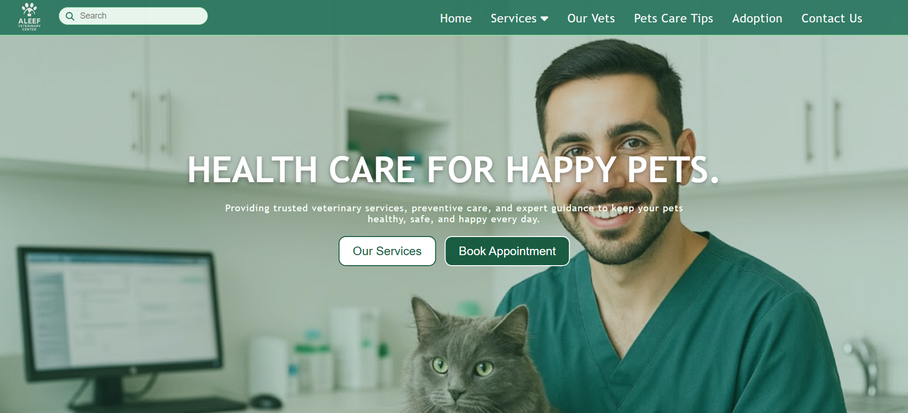

# ALEEF Veterinary Center Website 🐾

Welcome to the official ALEEF Veterinary Center website!  
This is a responsive and clean front-end project designed to present the services and information of the veterinary clinic in a clear and friendly format.

## 📌 About the Project
This website showcases the main sections of the ALEEF Veterinary Center including:
- A welcoming hero section
- Services offered by the clinic
- Doctors and team introduction
- Contact information

The design focuses on simplicity, responsiveness, and easy navigation for visitors.

## 🛠 Built With
- **HTML5**
- **CSS3**
  
No JavaScript was used in this project.

## 📱 Responsive Design
The layout adapts to different screen sizes (desktop, tablet, mobile), ensuring the site looks great on all devices.

## 🚀 How to Use
1. Simply open the repository
2. Launch the `index.html` file in any modern web browser

## 🌐 Visit the Live Site
You can see the live version here:  
👉 https://abd-eid.github.io/ALEEF-Veterinary-Center-Website/

## 👤 Author
**Abd-eid**  
GitHub: https://github.com/Abd-eid
